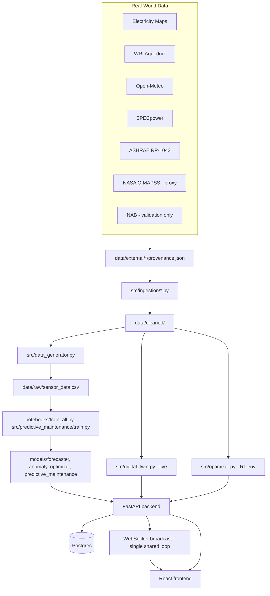

# Architecture

## System diagram

## Layering

- **`api/routes/`** — thin HTTP handlers
- **`api/services/`** — business logic, singleton model/twin instances
- **`api/repositories/`** — all DB access
- **`api/schemas/`** — Pydantic request/response models
- **`src/`** — physics (`digital_twin.py`), RL environment (`optimizer.py`), data generation, ML models

## Physics: single source of truth

`data_generator.py` calls `DigitalTwin`'s own methods rather than reimplementing physics — fixed in Phase 4 after finding the two had drifted (different airflow constants, no idle-power floor, fixed-COP-only cooling). `DataCentreEnv` (the RL environment) has its own physics implementation, deliberately, because the RL agent needs to choose actions the live twin doesn't — but the two are kept consistent by sharing the same threshold constants (e.g. `DROUGHT_THRESHOLD = 0.7` in both files) and the same `carbon_provider` module.

## Known architectural gap

Training data (`data/raw/sensor_data.csv`, via `data_generator.py`) does not yet include `carbon_intensity_gco2_per_kwh`, `carbon_gco2`, or `drought_override_active` — these were added to `DigitalTwin`'s live state in Phase 10, after Phase 4 last touched the generator. The LSTM forecaster and anomaly detector are trained without these signals, even though the live system and RL environment both have them. Backfilling this is a clear, scoped next task.

## Two-track deployment

Production (Railway) builds via Nixpacks; the Dockerfile is for local dev and CI verification only. See `DEPLOYMENT.md` for why these are intentionally separate.

## Real-time architecture

One shared background task steps the twin and broadcasts to all connected WebSocket clients (Phase 11) — not one simulation loop per client, which was the original (buggy) implementation. In-process, not Redis pub/sub — appropriate for a single backend instance; revisit if scaling to multiple processes.