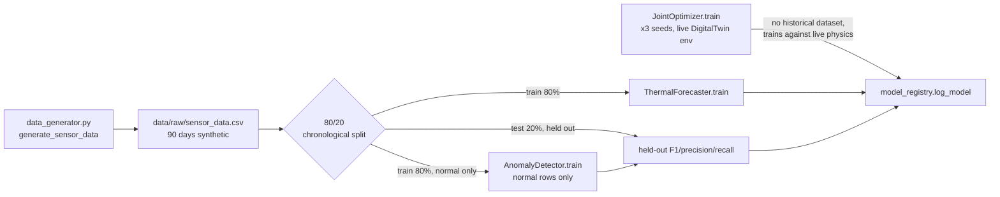
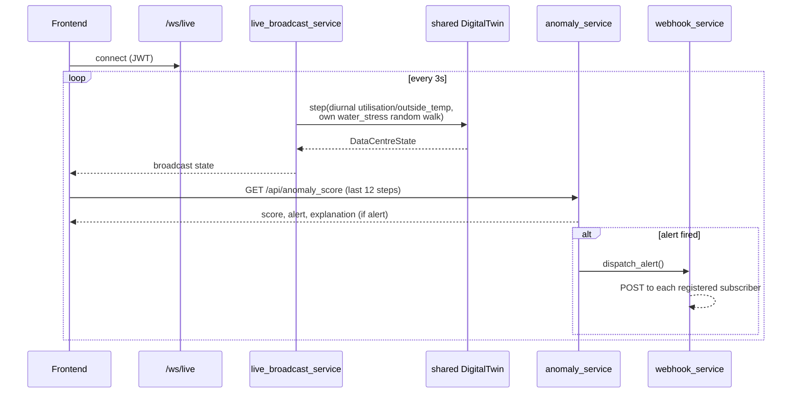

# Data Flow

## Training-time (offline)

## Request-time (live)

## Notes

- The live broadcast loop and `/api/simulate`/`/api/whatif` are
  **deliberately independent** data paths: the broadcast loop generates
  its own diurnal utilisation/outside-temp/water-stress (autonomous "live
  facility" telemetry), while `/api/simulate` and `/api/whatif` build
  profiles from the sidebar's slider values (a "what-if" preview). See the
  Sustainability tab's "Live Water Stress" label and Phase 0 fix #3.
- `/api/anomaly_score` is polled by the frontend every ~3s; the webhook
  path (Phase 3) is the alternative for external consumers who shouldn't
  have to poll.
