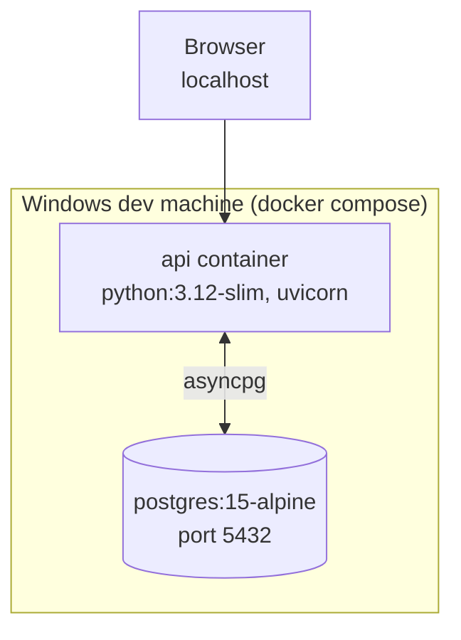
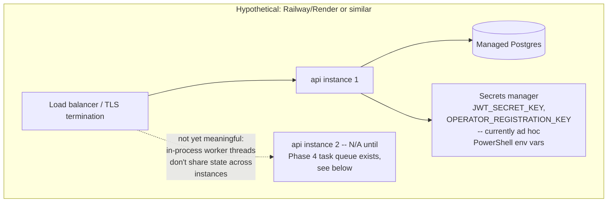

# Deployment Topology

## Current state (as of this doc): local Docker Compose only

**Never deployed to an actual platform yet** (Railway/Render were the
original targets) — this is an open item carried since the original
handoff, not resolved by any phase so far. Everything in this repo has
only been verified via `docker compose up` locally.

## What a real deploy would add (not yet built)

Running more than one API instance today would break the in-process
worker-thread pattern used for `/api/optimize`'s fallback training and
the shared live-broadcast twin singleton (`get_twin()`), both of which
assume a single process. A real multi-instance deploy needs Phase 4's
task queue + a way to share the live twin's state (or accept that only
one instance runs the broadcast loop) before this diagram's `API2` box
means anything.
