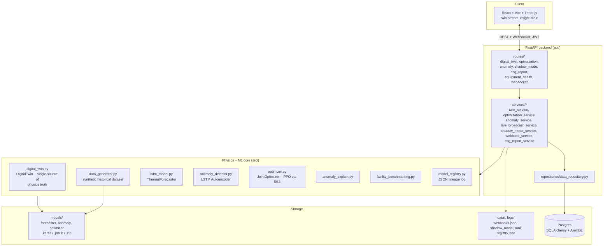

# System Architecture

## Notes

- **`DigitalTwin` is the single source of physics truth.** Both the live
  API path (`step()`/`run_scenario()`) and the offline historical-dataset
  generator (`data_generator.py`, used to train the forecaster and anomaly
  detector) call the same physics methods
  (`compute_cooling_power`/`compute_outlet_temp`/`effective_air_flow_m3_s`).
  Keeping these in sync is why Phase 0's COP and airflow fixes touched
  both call sites, not just the live one -- see the fix commits and
  `docs/model_cards/LIMITATIONS.md`.
- **No message queue yet** (Phase 4, not built): `/api/optimize`'s
  fallback training and PDF report generation run in worker threads
  (`run_in_threadpool`/`asyncio.to_thread`), not a real task queue.
- **File-based state alongside Postgres**: `models/registry.json` (model
  lineage), `data/webhooks.json` (subscribers), `logs/shadow_mode.jsonl`
  (PPO-vs-baseline samples) are deliberately JSON/JSONL, not new DB
  tables -- see each module's docstring for why (avoiding untested
  migrations for opt-in/diagnostic features).
